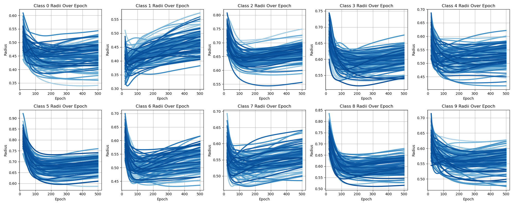

# Section 3: *Towards Objective Identifiers of Hard Samples*

## Description

The [replicate_inversion_results_on_multiple_classes.py](replicate_inversion_results_on_multiple_classes.py) program 
generalizes the approach introduced by [Ciceri et al. (2024)](https://www.nature.com/articles/s42256-023-00772-9) to
multiclass classification. The program trains a specified number of models (default to 100) with different 
initialization and computes the evolution of the radii of class manifolds over epochs, plotting the results for 
visualization. The results prove the generalizability of the 'inversion point' to multiclass classification, albeit 
with an emergence of class-specific characteristics.

## Requirements

Below are the requirements for all of our code:

- Python 3.x
- PyTorch
- torchmetrics
- torchvision
- matplotlib
- tqdm
- numpy

Make sure you have the required libraries installed. You can install them using pip:

```bash
pip install torch torchmetrics torchvision matplotlib tqdm numpy
```

## Running the Code

To run [replicate_inversion_results_on_multiple_classes.py](replicate_inversion_results_on_multiple_classes.py), use
the following command in your terminal:

```bash
python replicate_inversion_results_on_multiple_classes.py --dataset_name [DATASET_NAME] --subset_size [SUBSET_SIZE] --number_of_runs [NUMBER_OF_RUNS]
```

### Parameters

- `--dataset_name`: Specifies the name of the dataset to load for the analysis. The dataset must be available in 
`torchvision.datasets`. Currently, the code only works for single-colour datasets. **Default value is `MNIST`.**
- `--subset_size`: Integer specifying the size of the dataset subset to use for training and analysis. This allows for 
quicker iterations during experimentation. **Default value is `20000`.** Actual experiments were conducted on `70000`.
- `--number_of_runs`: Integer specifying how many times the experiment will be rerun. We use 100 runs by default but 
the user is free to adjust it

## Expected Results

When running `python replicate_inversion_results_on_multiple_classes.py`, the 
following result is observed:



This figure looks very chaotic when `number_of_runs` is larger than 5 (as can be seen above). Because of that we have 
also prepared `plotting_mean_radii_over_epochs.py` to display average results (see the Figure below). This function 
uses the data saved by `plotting_mean_radii_over_epochs.py` in lines 19-20. To run it use the following command: 
`python plotting_mean_radii_over_epochs.py`. Note that the Algorithm 1 from Appendix B describes the `train_model` 
function from the `utils.py` file. The code that computes the radii of class manifolds is a modified version of 
https://github.com/marco-gherardi/stragglers. The projection of class manifolds, mentioned in our paper, happens in 
line 36 of `neural_networks.py`.


All our experiments were performed on random subset of the used datasets (see `load_data_and_normalize` function in 
`utils.py`) with 20,000 data samples. Running those experiments on the whole dataset does not bring a significant 
change, but greatly increases the time necessary to run the experiment.

# Sections 4-5: In-class Data Imbalance & Benchmarking Hard Sample Identification Methods

## Description

The [verifying_importance_of_stragglers.py](verifying_importance_of_stragglers.py) program allows for measuring the performance of a SimpleNN on the easy
and hard samples from the dataset specified by the user. The program first divides the dataset (or its subset - see 
`--subset_size`) into hard and easy samples based on the specified hard sample identifier (see `--strategy`). This is
accomplished by the `identify_hard_samples` function from the `utils.py` file. There is a couple of implementation 
information that is worth mentioning:
  - If the program wasn't able to find all 10 inversion points the function is called again (see lines 348-352 of 
`utils.py`)
  - If the strategy is set to *confidence* or *energy*, then the number of stragglers is used as a threshold - we pass 
`aggregated_stragglers` to  `identify_hard_samples_with_model_accuracy` which further uses it in lines 220 or 247 
(depending on the `--level` parameter)

After that we pass the easy and hard samples to `straggler_ratio_vs_generalisation` that later divides them into 
training and test sets. After that it trains `--runs` networks per ratio in `--remaining_train_ratios`. The function 
uses Accuracy, Precision, Recall and F1-score as metrics to show that the metrics used in detecting class-imbalance do 
not necessarily transfer to in-class data imbalance. The obtained results are saved in the Results folder.

## Requirements

The [verifying_importance_of_stragglers.py](verifying_importance_of_stragglers.py) has the same requirements as the ones 
described [here](#requirements).

## Running the Code

To run [verifying_importance_of_stragglers.py](verifying_importance_of_stragglers.py), use
the following command in your terminal:

```bash
python verifying_importance_of_stragglers.py --dataset_name [DATASET_NAME] --strategy [STRATEGY] --runs [RUNS] --train_ratios [TRAIN_RATIOS] --remaining_train_ratios [REMAINING_TRAIN_RATIOS] --reduce_hard [REDUCE_HARD] --level [LEVEL] --noise_ratio [NOISE_RATIO] --subset_size [SUBSET_SIZE] --evaluation_network [EVAULATION_NETWORK]
```

Note that all the parameters have a default value, so you can simply run `python verifying_importance_of_stragglers.py`.

## Parameters

- `--dataset_name`: Specifies the name of the dataset to load for the analysis. The dataset must be available in 
`torchvision.datasets`. The code was tested on `MNIST`, `FashionMNIST`, and `KMNIST`. **Default value is `MNIST`.**

- `--strategy`: Specifies the strategy (method) to use for identifying hard samples. The possible options are 
`stragglers`, `confidence`, and `energy`. **Default value is `stragglers`.**

- `--runs`: Specifies how many straggler sets will be obtained and how many networks will be trained per setting in 
straggler set. If set to 2, then a total of `runs * len(remaining_train_ratios) * len(train_ratios)` networks will be 
trained per straggler set (so a total of `runs * runs * len(remaining_train_ratios) * len(train_ratios)` networks).
**Default value is 3.**

- `--train_ratios`: A list of percentages representing the train set to the whole dataset size, used to infer 
training:test ratio. For example, `0.9 0.5` means that the experiment is repeated twice, with training set taking 
90% and 50% of the data, respectively. **Default values are `[0.9, 0.5]`. ** Actual experiments were conducted on
`[0.9, 0.7, 0.5]`.

- `--remaining_train_ratios`: A list of percentages of train hard/easy samples on which we train; we only reduce the 
number of hard OR easy samples (depending on the `--reduce_hard` flag). So, `0.1` means that 90% of hard samples will 
be removed from the train set before training (when `reduce_hard == True`). **Default values are 
`[0.0, 0.05, 0.1, 0.15, 0.2, 0.25, 0.5, 0.75, 1.0]`.** Actual experiments were conducted on 
`[0.0, 0.05, 0.1, 0.15, 0.2, 0.25, 0.5, 0.75, 1.0]` when `reduce_hard == False`, and `[0.0, 0.25, 0.5, 0.75, 1.0]` 
otherwise.

- `--reduce_hard`: A flag indicating whether to reduce the number of hard (True) or easy (False) samples from the 
training data. **By default, this is set to `False`, focusing on reducing easy samples.**

- `--level`: Specifies the level at which confidence and energy are computed, with possible options being `class` and 
`dataset`. **Default value is `dataset`.** This choice affects how the analysis interprets individual sample difficulty 
or energy levels across the entire dataset or within each class.

- `--noise_ratio`: The ratio of the added label noise. Setting this will introduce noisy labels into the dataset, with 
`(100*noise_ratio)%` of labels becoming incorrect. This simulates a dataset with existing labeling errors to examine 
the model's robustness to label noise. **Default value is `0.0`, meaning no noise is added by default.**

- `--subset_size`: Integer specifying the size of the dataset subset to use for training and analysis. This parameter 
allows for quicker iterations during experimentation. **There is no default value provided in the code snippet; ensure 
to specify this parameter when running the script.** Actual experiments were conducted on subsets up to `70000`, but 
using `20000` should give good enough results (although less reliable).

- `--evaluation_network`: Allows to change the network used when investigating the in-class imbalance. The default is 
set to *SimpleNN*, and it can be changed to *ResNet*. Changing the value to *ResNet* means that network of different 
architecture will be used to divide the data into easy and hard samples (`identify_hard_samples`, and to test the 
generalization properties of easy/hard samples (`straggler_ratio_vs_generalisation`).

## Expected Results

Running `python verifying_importance_of_stragglers.py` gives us information on the generalization capabilities to easy 
and hard samples (obtained via straggler-based hard sample identifier) from the MNIST dataset upon varying the number of 
easy samples in the training set. All this information is visible in the Figure below that is produced by 
`verifying_importance_of_stragglers.py` and saved in the Figures folder.

In order to replicate all the results necessary to obtain Figures 3 and 4 from our paper you need to run all the 
following:

  - `python3 verifying_importance_of_stragglers.py --runs 5 --train_ratios 0.9 0.7 0.5`
  - `python3 verifying_importance_of_stragglers.py --runs 5 --train_ratios 0.9 0.7 0.5 --dataset_name KMNIST`
  - `python3 verifying_importance_of_stragglers.py --runs 5 --train_ratios 0.9 0.7 0.5 --dataset_name FashionMNIST`
  - `python3 verifying_importance_of_stragglers.py --runs 5 --train_ratios 0.9 0.7 0.5 --remaining_train_ratios 0.0 0.25 0.5 0.75 1.0 --reduce_hard`
  - `python3 verifying_importance_of_stragglers.py --runs 5 --train_ratios 0.9 0.7 0.5 --remaining_train_ratios 0.0 0.25 0.5 0.75 1.0 --reduce_hard --dataset_name KMNIST`
  - `python3 verifying_importance_of_stragglers.py --runs 5 --train_ratios 0.9 0.7 0.5 --remaining_train_ratios 0.0 0.25 0.5 0.75 1.0 --reduce_hard --dataset_name FashionMNIST`

In order to produce the information necessary to obtain Figure 7 you need to also run the following:

  - `python3 verifying_importance_of_stragglers.py --runs 5 --train_ratios 0.9 0.7 0.5 --strategy confidence`
  - `python3 verifying_importance_of_stragglers.py --runs 5 --train_ratios 0.9 0.7 0.5 --strategy energy`
  - `python3 verifying_importance_of_stragglers.py --runs 5 --train_ratios 0.9 0.7 0.5 --remaining_train_ratios 0.0 0.25 0.5 0.75 1.0 --reduce_hard --strategy confidence`
   `python3 verifying_importance_of_stragglers.py --runs 5 --train_ratios 0.9 0.7 0.5 --remaining_train_ratios 0.0 0.25 0.5 0.75 1.0 --reduce_hard --strategy energy`

This will gather all the information necessary to produce Figure 7. In order to produce that Figure run 
`python3 plotting_results.py`. The resulting Figures are saved in `Figures/Figure 7/`. Below we show one of the produced 
figures (7a)


# Further Experiments (Appendix E, Figure 8)

Apart from recording the Accuracy, Precision, Recall and F1-Score we also save the indices of the found hard samples.
This allows us to compute the distribution of hard samples among classes and the overlap between the hard samples found 
by different methods.

### Measuring class-level distribution of hard samples

All the necessary information to compute the distribution of hard samples between classes is available in the 
`*_indices.pkl` files produces by `verifying_importance_of_stragglers.py`. Those files contain the indices of the hard 
samples found using different hard sample identifiers. Simply run `python3 hard_sample_distribution_over_classes.py` 
after you have generated those .pkl files. This will produce the following Figure (see below) in the `Figures/Figure 8` 
folder. The program has two parameters - `--dataset_name` and `--strategy` and they have the same meaning as in
`verifying_importance_of_stragglers.py`. If you want to see the distribution of hard samples between classes on KMNIST
simply change the `--dataset_name` parameter.


We believe that the distribution of hard samples is correlated to the class-level accuracy. We measure it below.
The idea is fairly simple - train `--runs` networks, each with distinct initialization, on a specified dataset (we use 
the same training hyperparameters as in earlier experiments), and measure class-level test accuracy. Afterward, present
mean and std in a form of a bar chart. Below is an example of the result that we get after running: 
`python3 class_level_accuracies.py --dataset_name MNIST --subset_size 70000`. The correlation between the two figures 
is very apparent (The Pearson correlation coefficient is equal to 0.95).


#### Parameters

- `--dataset_name`: Same meaning as in `verifying_importance_of_stragglers.py`
- `--subset_size`: Same meaning as in `verifying_importance_of_stragglers.py`
- `--overfit`: A flag that allows the user to specify if they want to divide the dataset into training and test set (in 
which case don't call this flag), or train on the entire dataset, as we used to do when identifying hard samples.
- `--runs`: Specifies how many models will be trained to obtain the averaged results.

### Measuring overlap between hard samples obtained via different methods

Here we use the information gathered in the `Results/F1_results/MNIST_{strategy}_False_20000_indices.pkl` files produced
by `verifying_importance_of_stragglers.py`. After running `python3 compute_overlap.py` the overlap is being printed in 
the console.